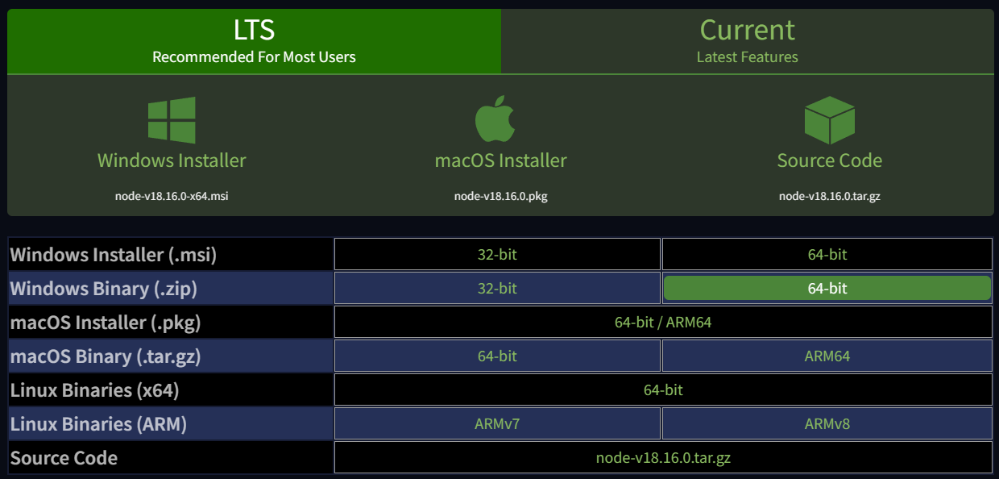
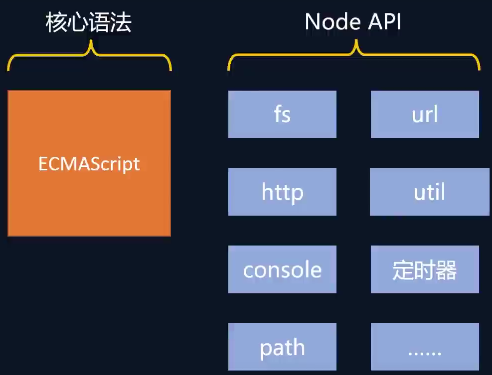

# 入门

## Node.js 是什么
Node.js是一个开源的，跨平台的JavaScript运行环境

通俗来讲：Node.js就是一款应用程序，是一款软件，它可以运行JavaScript


## Node.js 的作用
1. 开发服务器应用
2. 开发工具类应用：比如Webpack、Vite、Babel
3. 开发桌面端应用：Electron 比如VSCode、Figma、Postman


## Node.js 的安装
[Node.js官网](https://nodejs.org/)
- [Downloads](https://nodejs.org/en/download)



解压后将node.exe所在的目录添加到环境变量中即可。
```bash
node -v
```


## Node.js 注意事项
- 浏览器中的JavaScript
  
- Node.js 中的JavaScript
  

1. Node.js 中不能使用BOM和DOM的API，可以使用console和定时器(`setTimeout`、`setInterval`)的API
2. Node.js 中的顶级对象为global，也可以用globalThis访问顶级对象 `globalThis === global`

