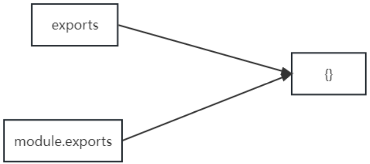
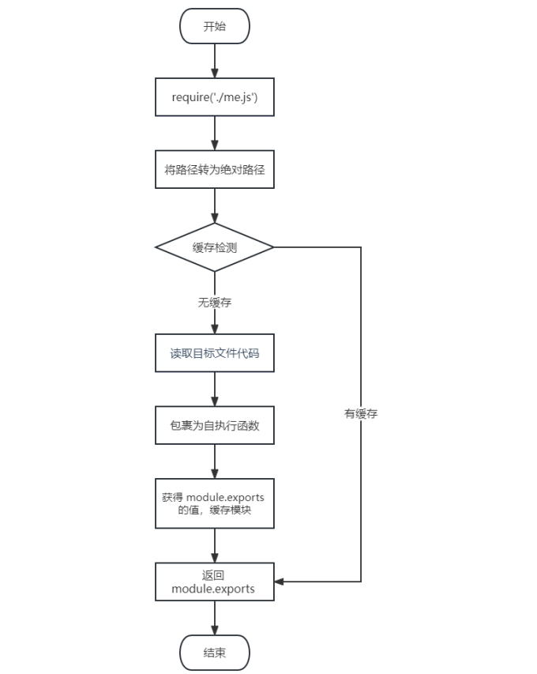

# Node.js 模块化

## 一、介绍

### 1.1 什么是模块化与模块 ?
将一个复杂的程序文件依据一定规则（规范）拆分成多个文件的过程称之为 `模块化`

其中拆分出的 `每个文件就是一个模块` ，模块的内部数据是私有的，不过模块可以暴露内部数据以便其他模块使用

### 1.2 什么是模块化项目 ?
编码时是按照模块一个一个编码的， 整个项目就是一个模块化的项目

### 1.3 模块化好处
下面是模块化的一些好处：
1. 防止命名冲突
2. 高复用性
3. 高维护性


## 二、模块暴露数据

### 2.1 模块初体验
可以通过下面的操作步骤，快速体验模块化
1. 创建 [me.js](代码/05_模块化/代码/01_初体验/me.js)
   ```js
   //声明函数
   function tiemo() {
       console.log('贴膜....');
   }
   //暴露数据
   module.exports = tiemo;
   ```
2. 创建 [index.js](代码/05_模块化/代码/01_初体验/index.js)
   ```js
   //导入模块
   const tiemo = require('./me.js');
   //调用函数
   tiemo();
   ```

### [2.2 暴露数据](代码/05_模块化/代码/02_模块暴露数据/me.js)
模块暴露数据的方式有两种：
1. module.exports = value
2. exports.name = value

> 使用时有几点注意：
> - module.exports 可以暴露 `任意` 数据
> - 不能使用 `exports = value` 的形式暴露数据，模块内部 module 与 exports 的隐式关系 `exports = module.exports = {}`  `exports === module.exports`  
> require 返回的是目标模块中 `module.exports` 的值  




## [三、导入（引入）模块](代码/05_模块化/代码/03_导入模块/index.js)
在模块中使用 require 传入文件路径即可引入文件
```js
const test = require('./me.js');
```

require 使用的一些注意事项：
1. 对于自己创建的模块，导入时路径建议写 `相对路径` ，且不能省略 `./` 和 `../`
2. `js` 和 `json` 文件导入时可以不用写后缀（优先查找js文件），c/c++编写的 `node` 扩展文件也可以不写后缀，但是一般用不到
3. 如果导入其他类型的文件，会以 `js` 文件进行处理
4. 如果导入的路径是个文件夹，则会 `首先` 检测该文件夹下 `package.json` 文件中 `main` 属性对应的文件，
   - 如果存在则导入，反之如果文件不存在会报错。
   - 如果 `main` 属性不存在，或者 `package.json` 不存在，则会尝试导入文件夹下的 `index.js` 和 `index.json` ，如果还是没找到，就会报错
5. 导入 node.js 内置模块时，直接 require 模块的名字即可，无需加 `./` 和 `../`


## [四、导入模块的基本流程](代码/05_模块化/代码/05_require/show.js)
这里我们介绍一下 `require` 导入 `自定义模块` 的基本流程
1. 将相对路径转为绝对路径，定位目标文件
2. 缓存检测
3. 读取目标文件代码
4. 包裹为一个函数并执行（自执行函数）。通过 `arguments.callee.toString()` 查看自执行函数
5. 缓存模块的值
6. 返回 `module.exports` 的值




## 五、CommonJS 规范
`module.exports` 、 `exports` 以及 `require` 这些都是 `CommonJS` 模块化规范中的内容。
而 `Node.js` 是实现了 `CommonJS` 模块化规范，二者关系有点像 `JavaScript` 与 `ECMAScript`

