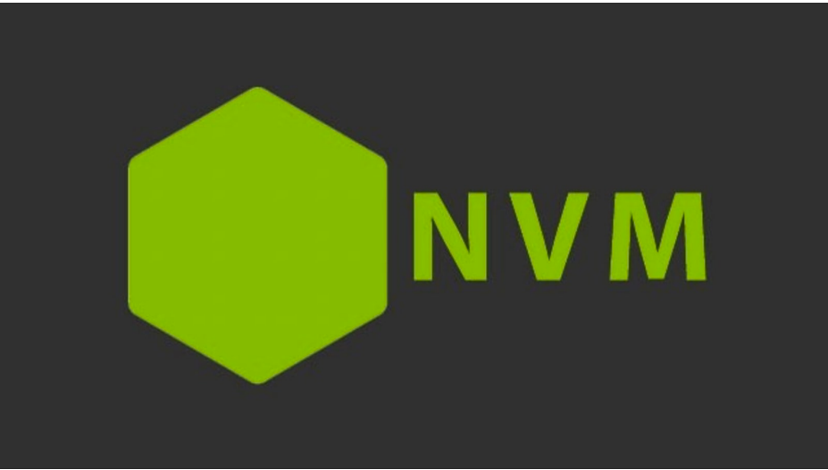

# nvm

## 一、介绍
nvm 全称 `Node Version Manager` 顾名思义它是用来管理 node 版本的工具，方便切换不同版本的 Node.js

## 二、使用
nvm 的使用非常的简单，跟 npm 的使用方法类似

### 2.1 下载安装
首先先下载 nvm，下载地址 https://github.com/coreybutler/nvm-windows/releases，
选择 `nvm-setup.exe` 下载即可（网络异常的小朋友可以在资料文件夹中获取）

### 2.2 常用命令
| 命令                  | 说明                            |
| --------------------- | ------------------------------- |
| nvm list available    | 显示所有可以下载的 Node.js 版本 |
| nvm list              | 显示已安装的版本                |
| nvm install 18.12.1   | 安装 18.12.1 版本的 Node.js     |
| nvm install latest    | 安装最新版的 Node.js            |
| nvm uninstall 18.12.1 | 删除某个版本的 Node.js          |
| nvm use 18.12.1       | 切换 18.12.1 的 Node.js         |

