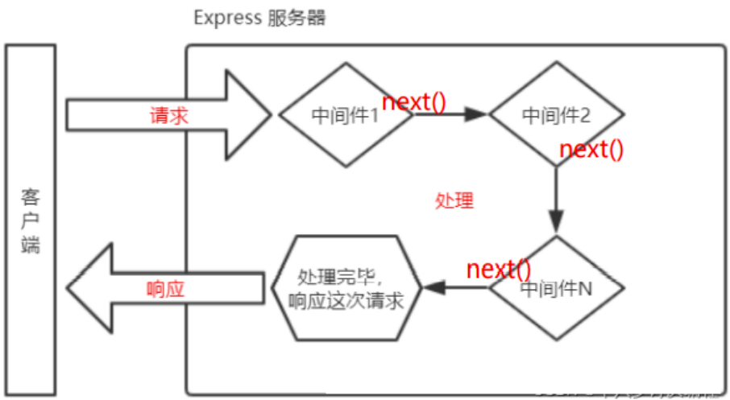

## 一、express 介绍
express 是一个基于 Node.js 平台的极简、灵活的 WEB 应用开发框架，官方网址：https://www.expressjs.com.cn/
简单来说，express 是一个封装好的工具包，封装了很多功能，便于我们开发 WEB 应用（HTTP 服务）


## 二、express 使用

### 2.1  express 下载
express 本身是一个 npm 包，所以可以通过 npm 安装
```bash
npm init
npm i express
```

### [2.2 express 初体验](代码/07_express/代码/01_初体验.js)
大家可以按照这个步骤进行操作：
1. 创建 JS 文件，键入如下代码
   ```js
   //1. 导入 express
   const express = require('express');
   //2. 创建应用对象
   const app = express();
   //3. 创建路由规则
   app.get('/home', (req, res) => {
       res.end('hello express server');
   });
   //4. 监听端口 启动服务
   app.listen(3000, () => {
       console.log('服务已经启动, 端口监听为 3000...');
   });
   ```
2. 命令行下执行该脚本
   ```bash
    node <文件名>
    # 或者
    nodemon <文件名>
    ```
3. 然后在浏览器就可以访问 http://127.0.0.1:3000/home 👌


## 三、express 路由

### 3.1  什么是路由
官方定义： `路由确定了应用程序如何响应客户端对特定端点的请求`

### 3.2 路由的使用
一个路由的组成有 `请求方法` ， `路径` 和 `回调函数` 组成

express 中提供了一系列方法，可以很方便的使用路由，使用格式如下：
```js
app.<method>(path，callback)
```

[代码示例](代码/07_express/代码/02_路由.js)：
```js
//导入 express
const express = require('express');
//创建应用对象
const app = express();
//创建 get 路由
app.get('/home', (req, res) => {
    res.send('网站首页');
});
//首页路由
app.get('/', (req, res) => {
    res.send('我才是真正的首页');
});
//创建 post 路由
app.post('/login', (req, res) => {
    res.send('登录成功');
});
//匹配所有的请求方法
app.all('/search', (req, res) => {
    res.send('1 秒钟为您找到相关结果约 100,000,000 个');
});
//自定义 404 路由
app.all("*", (req, res) => {
    res.send('<h1>404 Not Found</h1>')
});
//监听端口 启动服务
app.listen(3000, () => {
    console.log('服务已经启动, 端口监听为 3000');
});
```

### [3.3 获取请求参数](代码/07_express/代码/03_获取请求参数.js)
express 框架封装了一些 API 来方便获取请求报文中的数据，并且兼容原生 HTTP 模块的获取方式
```js
//导入 express
const express = require('express');
//创建应用对象
const app = express();
//获取请求的路由规则
app.get('/request', (req, res) => {
    //1. 获取报文的方式与原生 HTTP 获取方式是兼容的
    console.log(req.method);
    console.log(req.url);
    console.log(req.httpVersion);
    console.log(req.headers);
    //2. express 独有的获取报文的方式
    //获取查询字符串
    console.log(req.query); // 『相对重要』
    // 获取指定的请求头
    console.log(req.get('host'));
    res.send('请求报文的获取');
});
//启动服务
app.listen(3000, () => {
    console.log('启动成功....')
});
```

### [3.4 获取路由参数](代码/07_express/代码/04_获取路由参数.js)
路由参数指的是 `URL 路径中的参数（数据）`
```js
app.get('/:id.html', (req, res) => {
    res.send('商品详情, 商品 id 为' + req.params.id);
});
```

> [路由参数练习](代码/07_express/代码/05_路由参数练习.js)


## [四、express 响应设置](代码/07_express/代码/06_设置响应.js)
express 框架封装了一些 API 来方便给客户端响应数据，并且兼容原生 HTTP 模块的获取方式
```js
//获取请求的路由规则
app.get("/response", (req, res) => {
    //1. express 中设置响应的方式兼容 HTTP 模块的方式
    res.statusCode = 404;
    res.statusMessage = 'xxx';
    res.setHeader('abc', 'xyz');
    res.write('响应体');
    res.end('xxx');
    //2. express 的响应方法
    res.status(500); //设置响应状态码
    res.set('xxx', 'yyy');//设置响应头
    res.send('中文响应不乱码');//设置响应体
    //连贯操作
    res.status(404).set('xxx', 'yyy').send('你好朋友')
    //3. 其他响应
    res.redirect('http://atguigu.com')//重定向
    res.download('./package.json');//下载响应
    res.json();//响应 JSON
    res.sendFile(__dirname + '/home.html') //响应文件内容
});
```

> [其他相应](代码/07_express/代码/07_其他响应.js)


## 五、express 中间件

### 5.1 什么是中间件
`中间件（Middleware）本质是一个回调函数`
`中间件函数` 可以像路由回调一样访问 `请求对象（request）` ， `响应对象（response）`

### 5.2 中间件的作用
`中间件的作用` 就是 `使用函数封装公共操作，简化代码`

### 5.3 中间件的类型
- 全局中间件
- 路由中间件

#### [5.3.1 定义全局中间件](代码/07_express/代码/08_全局中间件.js)
`每一个请求` 到达服务端之后 `都会执行全局中间件函数`
声明中间件函数
```js
let recordMiddleware = function (request, response, next) {
    //实现功能代码
    //......
    //执行next函数(当如果希望执行完中间件函数之后，仍然继续执行路由中的回调函数，必须调用next)
    next();
}
```


应用中间件
```js
app.use(recordMiddleware);
```

声明时可以直接将匿名函数传递给 `use`
```js
app.use(function (request, response, next) {
    //实现功能代码
    //.....
    //执行next函数(当如果希望执行完中间件函数之后，仍然继续执行路由中的回调函数，必须调用next)
    next();
});
```

#### 5.3.2 多个全局中间件
express 允许使用 app.use() 定义多个全局中间件
```js
app.use(function (request, response, next) {
    console.log('定义第一个中间件');
    next();
});
app.use(function (request, response, next) {
    console.log('定义第二个中间件');
    next();
});
```

#### [5.3.3 定义路由中间件](代码/07_express/代码/09_路由中间件.js)
如果 `只需要对某一些路由进行功能封装` ，则就需要路由中间件
调用格式如下：
```js
app.get('/路径', `中间件函数`, (request, response) => {
});
app.get('/路径', `中间件函数1`, `中间件函数2`, (request, response) => {
});
```

### [5.4 静态资源中间件](代码/07_express/代码/10_静态资源中间件.js)
express 内置处理静态资源的中间件
```js
//引入express框架
const express = require('express');
//创建服务对象
const app = express();
//静态资源中间件的设置，将当前文件夹下的public目录作为网站的根目录
app.use(express.static('./public')); //当然这个目录中都是一些静态资源
//如果访问的内容经常变化，还是需要设置路由
//但是，在这里有一个问题，如果public目录下有index.html文件，单独也有index.html的路由，
//则谁书写在前，优先执行谁
app.get('/index.html', (request, response) => {
    respsonse.send('首页');
});
//监听端口
app.listen(3000, () => {
    console.log('3000 端口启动....');
});
```

> 注意事项:
> 1. index.html 文件为默认打开的资源
> 2. 如果静态资源与路由规则同时匹配，谁先匹配谁就响应
> 3. 路由响应动态资源，静态资源中间件响应静态资源

> [练习](代码/07_express/练习/02_静态资源中间件练习/server.js)

### [5.5 获取请求体数据 body-parser](代码/07_express/代码/11_获取请求体数据.js)
express 可以使用 body-parser 包处理请求体
第一步：安装
```bash
npm i body-parser
```

第二步：导入 body-parser 包
```js
const bodyParser = require('body-parser');
```

第三步：获取中间件函数
```js
//处理 querystring 格式的请求体
let urlParser = bodyParser.urlencoded({ extended: false });
//处理 JSON 格式的请求体
let jsonParser = bodyParser.json();
```

第四步：设置路由中间件，然后使用 request.body 来获取请求体数据
```js
app.post('/login', urlParser, (request, response) => {
    //获取请求体数据
    //console.log(request.body);
    //用户名
    console.log(request.body.username);
    //密码
    console.log(request.body.userpass);
    response.send('获取请求体数据');
});
```

获取到的请求体数据：
```
[Object: null prototype] { username: 'admin', userpass: '123456' }
```

> 中间件应用：[图片防盗链](代码/07_express/代码/12_图片防盗链.js)


## 六、Router

### 6.1 什么是 Router
express 中的 Router 是一个完整的中间件和路由系统，可以看做是一个小型的 app 对象。

### 6.2 Router 作用
对路由进行模块化，更好的管理路由

### 6.3 Router 使用
创建独立的 JS 文件（[homeRouter.js](代码/07_express/代码/routes/homeRouter.js)）
```js
//1. 导入 express
const express = require('express');
//2. 创建路由器对象
const router = express.Router();
//3. 在 router 对象身上添加路由
router.get('/', (req, res) => {
    res.send('首页');
})
router.get('/cart', (req, res) => {
    res.send('购物车');
});
//4. 暴露
module.exports = router;
```

[主文件](代码/07_express/代码/13_路由模块化.js)
```js
const express = require('express');
const app = express();
//5.引入子路由文件
const homeRouter = require('./routes/homeRouter');
//6.设置和使用中间件
app.use(homeRouter);
app.listen(3000, () => {
    console.log('3000 端口启动....');
});
```


## 七、EJS 模板引擎

### 7.1 什么是模板引擎
模板引擎是分离 `用户界面和业务数据` 的一种技术

### 7.2 什么是 EJS
EJS 是一个高效的 Javascript 的模板引擎
- 官网: https://ejs.co/
- 中文站：https://ejs.bootcss.com/

### 7.3  EJS 初体验
下载安装EJS
```bash
npm i ejs --save
```

[代码示例](代码/07_express/代码/14-模板引擎/01_EJS初体验.js)
```js
//1.引入ejs
const ejs = require('ejs');
//2.定义数据
let person = ['张三', '李四', '王二麻子'];
//3.ejs解析模板返回结构
//<%= %> 是ejs解析内容的标记，作用是输出当前表达式的执行结构
let html = ejs.render('<%= person.join(",") %>', { person: person });
//4.输出结果
console.log(html);
```

命令行下运行

### 7.4 EJS 常用语法
执行JS代码
```
<% code %>
```

输出转义的数据到模板上
```
<%= code %>
```

输出非转义的数据到模板上
```
<%- code %>
```

### [7.5 Express 中使用 EJS](代码/07_express/代码/14-模板引擎/04_express中使用ejs.js)

### [7.6 express-generator](代码/07_express/代码/15-generator/app.js)
