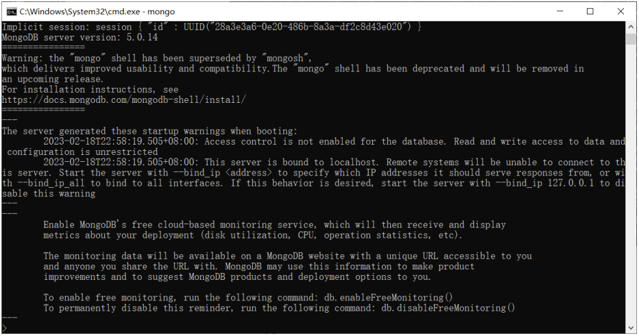

# MongoDB

## 一、简介

### 1.1 Mongodb 是什么
MongoDB 是一个基于分布式文件存储的数据库，官方地址 https://www.mongodb.com/

### 1.2 数据库是什么
数据库（DataBase）是按照数据结构来组织、存储和管理数据的 `应用程序`

### 1.3 数据库的作用
数据库的主要作用就是 `管理数据` ，对数据进行 `增（c）、删（d）、改（u）、查（r）`

### 1.4 数据库管理数据的特点
相比于纯文件管理数据，数据库管理数据有如下特点：
1. 速度更快
2. 扩展性更强
3. 安全性更强

### 1.5 为什么选择 Mongodb 
操作语法与 JavaScript 类似，容易上手，学习成本低


## 二、核心概念
Mongodb 中有三个重要概念需要掌握
- 数据库（database） 数据库是一个数据仓库，数据库服务下可以创建很多数据库，数据库中可以存放很多集合
- 集合（collection） 集合类似于 JS 中的数组，在集合中可以存放很多文档
- 文档（document） 文档是数据库中的最小单位，类似于 JS 中的对象


JSON 文件示例：
```json
{
    "accounts": [
        {
            "id": "3-YLju5f3",
            "title": "买电脑",
            "time": "2023-02-08",
            "type": "-1",
            "account": "5500",
            "remarks": "为了上网课"
        },
        {
            "id": "3-YLju5f4",
            "title": "请女朋友吃饭",
            "time": "2023-02-08",
            "type": "-1",
            "account": "214",
            "remarks": "情人节聚餐"
        },
        {
            "id": "mRQiD4s3K",
            "title": "发工资",
            "time": "2023-02-19",
            "type": "1",
            "account": "4396",
            "remarks": "终于发工资啦!~~"
        }
    ],
    "users": [
        {
            "id": 1,
            "name": "zhangsan",
            "age": 18
        },
        {
            "id": 2,
            "name": "lisi",
            "age": 20
        },
        {
            "id": 3,
            "name": "wangwu",
            "age": 22
        }
    ]
}
```

大家可以通过 JSON 文件来理解 Mongodb 中的概念
- 一个 `JSON` 文件 好比是一个 `数据库` ，一个 Mongodb 服务下可以有 N 个数据库
- JSON 文件中的 `一级属性的数组值` 好比是 `集合`
- 数组中的对象好比是 `文档`
- 对象中的属性有时也称之为 `字段`

> 一般情况下
> - 一个项目使用一个数据库
> - 一个集合会存储同一种类型的数据


## 三、下载安装与启动
下载地址： https://www.mongodb.com/try/download/community

建议选择 `zip` 类型， 通用性更强


配置步骤如下:
1. 将压缩包移动到 `C:\Program Files` 下，然后解压
2. 创建 `C:\data\db` 目录，mongodb 会将数据默认保存在这个文件夹
3. 以 mongodb 中 bin 目录作为工作目录，启动命令行
4. 运行命令 `mongod`


看到最后的 `waiting for connections` 则表明服务 `已经启动成功`
然后可以使用 `mongo` 命令连接本机的 mongodb 服务


> 注意：
> - 为了方便后续方便使用 mongod 命令，可以将 bin 目录配置到环境变量 Path 中
> - `千万不要选中服务端窗口的内容` ，选中会停止服务，可以 `敲回车` 取消选中


## 四、命令行交互
命令行交互一般是学习数据库的第一步，不过这些命令在后续用的比较少，所以大家了解即可

### 4.1 数据库命令
1. 显示所有的数据库
   ```bash
   show dbs
   ```
2. 切换到指定的数据库，如果数据库不存在会自动创建数据库
   ```bash
   use 数据库名称
   ```
3. 显示当前所在的数据库
   ```bash
   db
   ```
4. 删除当前数据库
   ```bash
   use 数据库名称
   db.dropDatabase()
   ```

### 4.2 集合命令
1. 创建集合
   ```bash
   db.createCollection('集合名称')
   ```
2. 显示当前数据库中的所有集合
   ```bash
   show collections
   ```
3. 删除某个集合
   ```bash
   db.集合名称.drop()
   ```
4. 重命名集合
   ```bash
   db.集合名称.renameCollection('新的集合名称')
   ```

### 4.3 文档命令
1. 插入文档
   ```bash
   db.集合名称.insert(文档对象)
   ```
2. 查询文档
   ```bash
   db.集合名称.find(查询条件)
   ```
   `_id 是 mongodb 自动生成的唯一编号，用来唯一标识文档`
3. 更新文档
   ```bash
   db.集合名称.update(查询条件, 新的文档)
   db.集合名称.update({name: '张三'}, {name: '张三', age: 19})
   ```
4. 删除文档
   ```bash
   db.集合名称.remove(查询条件)
   ```

### 4.4 应用场景

#### 4.4.1 新增
- 用户注册
- 发布视频
- 发布商品
- 发朋友圈
- 发评论
- 发微博
- 发弹幕
- ...

#### 4.4.2 删除
- 删除评论
- 删除商品
- 删除文章
- 删除视频
- 删除微博
- ...

#### 4.4.3 更新
- 更新个人信息
- 修改商品价格
- 修改文章内容
- ...

#### 4.4.4 查询
- 商品列表
- 视频列表
- 朋友圈列表
- 微博列表
- 搜索功能
- ...


## 五、Mongoose

### 5.1 介绍
Mongoose 是一个对象文档模型库，官网 http://www.mongoosejs.net/

### 5.2 作用
方便使用代码操作 mongodb 数据库

### [5.3 使用流程](代码/09_Mongodb/代码/01_mongoose基础/02_创建新文档.js)
```js
//1. 安装 mongoose
//2. 导入 mongoose
const mongoose = require('mongoose');
//3. 连接数据库
mongoose.connect('mongodb://127.0.0.1:27017/bilibili');
//4. 设置连接回调
//连接成功
mongoose.connection.on('open', () => {
    console.log('连接成功');
    //5. 创建文档结构对象
    let BookSchema = new mongoose.Schema({
        title: String,
        author: String,
        price: Number
    });
    //6. 创建文档模型对象
    let BookModel = mongoose.model('book', BookSchema);
    //7. 插入文档
    BookModel.create({
        title: '西游记',
        author: '吴承恩',
        price: 19.9
    }, (err, data) => {
        if (err) throw err;
        //输出 data 对象
        console.log(data);
        //8. 断开连接
        mongoose.disconnect();
    });
});
//连接出错
mongoose.connection.on('error', () => {
    console.log('连接出错~~');
});
//连接关闭
mongoose.connection.on('close', () => {
    console.log('连接关闭');
});
```

### [5.4 字段类型](代码/09_Mongodb/代码/01_mongoose基础/03_字段类型.js)
文档结构可选的常用字段类型列表
| 类型       | 描述                                                         |
| ---------- | ------------------------------------------------------------ |
| String     | 字符串                                                       |
| Number     | 数字                                                         |
| Boolean    | 布尔值                                                       |
| Array      | 数组，也可以使用 `[]` 来标识                                 |
| Date       | 日期                                                         |
| Buffer     | Buffer 对象                                                  |
| Mixed      | 任意类型，需要使用 `mongoose.Schema.Types.Mixed` 指定        |
| ObjectId   | 对象 ID，需要使用 `mongoose.Schema.Types.ObjectId` 指定      |
| Decimal128 | 高精度数字，需要使用 `mongoose.Schema.Types.Decimal128` 指定 |

### [5.5 字段值验证](代码/09_Mongodb/代码/01_mongoose基础/04_字段验证.js)
Mongoose 有一些内建验证器，可以对字段值进行验证

#### 5.5.1 必填项
```js
title: {
   type: String,
   required: true // 设置必填项
},
```

#### 5.5.2 默认值
```js
author: {
   type: String,
   default: '匿名' // 设置默认值
},
```

#### 5.5.3 枚举值
```js
gender: {
   type: String,
   enum: ['男', '女'] // 设置的值必须是数组中的
},
```

#### 5.5.4 唯一值
```js
username: {
   type: String,
   unique: true // 设置唯一值
},
```

> unique 需要 `重建集合` 才能有效果  
> 永远不要相信用户的输入  

### 5.6 CURD
数据库的基本操作包括四个，增加（create），删除（delete），修改（update），查（read）

#### 5.6.1 增加
插入一条
```js
SongModel.create({
    title: '给我一首歌的时间',
    author: 'Jay'
}, function (err, data) {
    //错误
    console.log(err);
    //插入后的数据对象
    console.log(data);
});
```

批量插入
```js
//1.引入mongoose
const mongoose = require('mongoose');
//2.链接mongodb数据库 connect 连接
mongoose.connect('mongodb://127.0.0.1:27017/project');
//3.设置连接的回调
mongoose.connection.on('open', () => {
    //4.声明文档结构
    const PhoneSchema = new mongoose.Schema({
        brand: String,
        color: String,
        price: Number,
        tags: Array
    })
    //6.创建模型对象
    const PhoneModel = mongoose.model('phone', PhoneSchema);
    PhoneModel.insertMany([
        {
            brand: '华为',
            color: '灰色',
            price: 2399,
            tags: ['电量大', '屏幕大', '信号好']
        },
        {
            brand: '小米',
            color: '白色',
            price: 2099,
            tags: ['电量大', '屏幕大', '信号好']
        }
    ], (err, data) => {
        if (err) throw err;
        console.log('写入成功');
        mongoose.connection.close();
    });
});
```

#### [5.6.2 删除](代码/09_Mongodb/代码/01_mongoose基础/05_删除文档.js)
删除一条数据
```js
SongModel.deleteOne({ _id: '5dd65f32be6401035cb5b1ed' }, function (err) {
    if (err) throw err;
    console.log('删除成功');
    mongoose.connection.close();
});
```

批量删除
```js
SongModel.deleteMany({ author: 'Jay' }, function (err) {
    if (err) throw err;
    console.log('删除成功');
    mongoose.connection.close();
});
```

#### [5.6.3 更新](代码/09_Mongodb/代码/01_mongoose基础/06_更新文档.js)
更新一条数据
```js
SongModel.updateOne({ author: 'JJ Lin' }, { author: '林俊杰' }, function (err) {
    if (err) throw err;
    mongoose.connection.close();
});
```

批量更新数据
```js
SongModel.updateMany({ author: 'Leehom Wang' }, { author: '王力宏' }, function (err) {
    if (err) throw err;
    mongoose.connection.close();
});
```

> 与命令行不同，更新时，不会把原来的数据覆盖掉，而是只更新你传入的字段。

#### [5.6.4 查询](代码/09_Mongodb/代码/01_mongoose基础/07_读取文档.js)
查询一条数据
```js
SongModel.findOne({ author: '王力宏' }, function (err, data) {
    if (err) throw err;
    console.log(data);
    mongoose.connection.close();
});
//根据 id 查询数据
SongModel.findById('5dd662b5381fc316b44ce167', function (err, data) {
    if (err) throw err;
    console.log(data);
    mongoose.connection.close();
});
```

批量查询数据
```js
//不加条件查询
SongModel.find(function (err, data) {
    if (err) throw err;
    console.log(data);
    mongoose.connection.close();
});
//加条件查询
SongModel.find({ author: '王力宏' }, function (err, data) {
    if (err) throw err;
    console.log(data);
    mongoose.connection.close();
});
```

### [5.7 条件控制](代码/09_Mongodb/代码/01_mongoose基础/08_条件设置.js)

#### 5.7.1 运算符
在 mongodb 不能 `> < >= <= !==` 等运算符，需要使用替代符号
- `>` 使用 `$gt`
- `<` 使用 `$lt`
- `>=` 使用 `$gte`
- `<=` 使用 `$lte`
- `!==` 使用 `$ne`

```js
db.students.find({ id: { $gt: 3 } }); //id号比3大的所有的记录
```

#### 5.7.2 逻辑运算
`$or` 逻辑或的情况
```js
db.students.find({ $or: [{ age: 18 }, { age: 24 }] });
```

`$and` 逻辑与的情况
```js
db.students.find({ $and: [{ age: { $lt: 20 } }, { age: { $gt: 15 } }] });
```

#### 5.7.3 正则匹配
条件中可以直接使用 JS 的正则语法，通过正则可以进行模糊查询
```js
db.students.find({ name: /imissyou/ });
```

### [5.8 个性化读取](代码/09_Mongodb/代码/01_mongoose基础/09_个性化读取.js)

#### 5.8.1 字段筛选
```js
//0:不要的字段
//1:要的字段
SongModel.find().select({ _id: 0, title: 1 }).exec(function (err, data) {
    if (err) throw err;
    console.log(data);
    mongoose.connection.close();
});
```

#### 5.8.2 数据排序
```js
//sort 排序
//1:升序
//-1:倒序
SongModel.find().sort({ hot: 1 }).exec(function (err, data) {
    if (err) throw err;
    console.log(data);
    mongoose.connection.close();
});
```

#### 5.8.3 数据截取
```js
//skip 跳过 limit 限定
SongModel.find().skip(10).limit(10).exec(function (err, data) {
    if (err) throw err;
    console.log(data);
    mongoose.connection.close();
});
```


## 六、 图形化管理工具
我们可以使用图形化的管理工具来对 Mongodb 进行交互，这里演示两个图形化工具
- [Robo 3T 免费](https://github.com/Studio3T/robomongo/releases)
- [Navicat 收费](https://www.navicat.com.cn/)
  - [安装](https://github.com/xftxyz2001/ways/blob/main/Navicat%20Windows%20%E7%A0%B4%E8%A7%A3.md)

