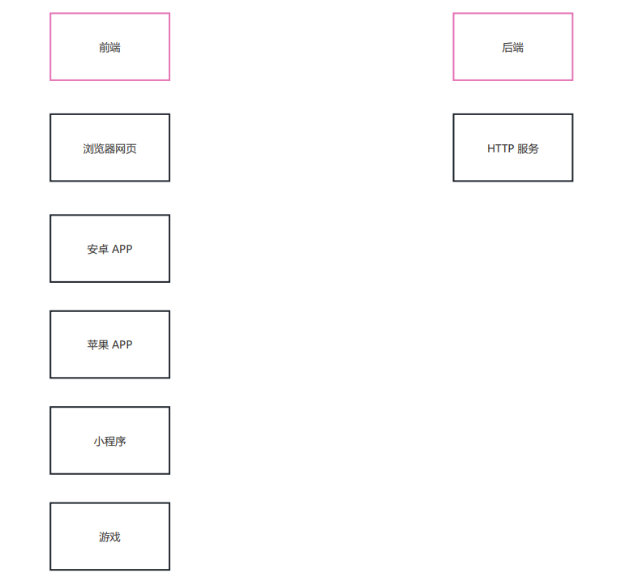
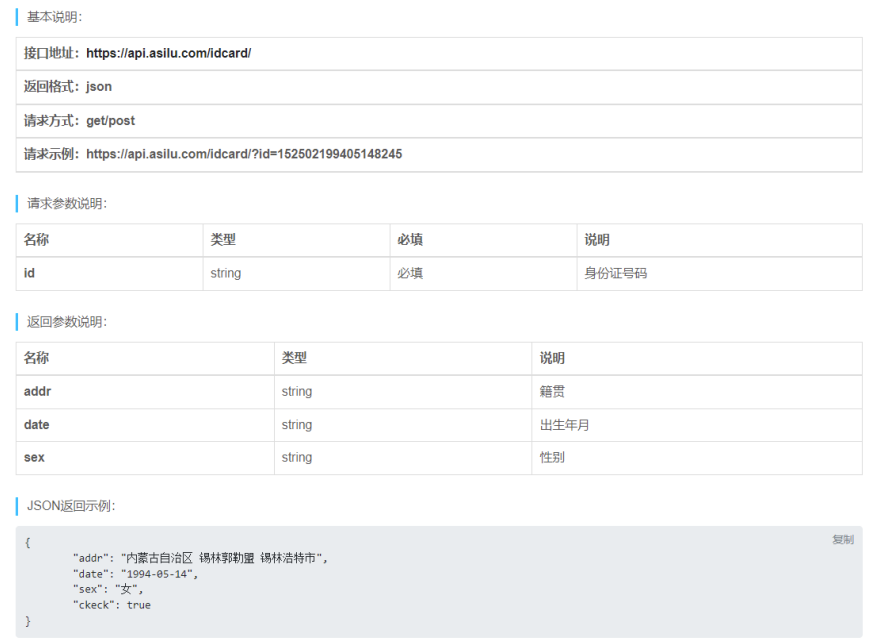

# 接口

## 一、简介

### 1.1 接口是什么
接口是 `前后端通信的桥梁`
简单理解：一个接口就是 `服务中的一个路由规则` ，根据请求响应结果
接口的英文单词是 API (Application Program Interface)，所以有时也称之为 `API 接口`
这里的接口指的是『数据接口』， `与编程语言（Java，Go 等）中的接口语法不同`

### 1.2 接口的作用
实现 `前后端通信`


### 1.3 接口的开发与调用
大多数接口都是由 `后端工程师` 开发的， `开发语言不限`
一般情况下接口都是由 `前端工程师` 调用的，但有时 `后端工程师也会调用接口` ，比如短信接口，支付接口等

### 1.4 接口的组成
一个接口一般由如下几个部分组成
- 请求方法
- 接口地址（URL）
- 请求参数
- 响应结果

一个接口示例 https://www.free-api.com/doc/325


> 体验一下：https://api.asilu.com/idcard/?id=371522199111299668


## 二、RESTful API
RESTful API 是一种特殊风格的接口，主要特点有如下几个：
- URL 中的路径表示 `资源` ，路径中不能有 动词 ，例如 `create` , `delete` , `update` 等这些都不能有
- 操作资源要与 `HTTP 请求方法` 对应
- 操作结果要与 `HTTP 响应状态码` 对应

规则示例：
| 操作                 | 请求类型 | URL      | 返回                 |
| -------------------- | -------- | -------- | -------------------- |
| 新增歌曲             | POST     | /song    | 返回新生成的歌曲信息 |
| 删除歌曲             | DELETE   | /song/10 | 返回一个空文档       |
| 修改歌曲             | PUT      | /song/10 | 返回更新后的歌曲信息 |
| 修改歌曲（部分字段） | PATCH    | /song/10 | 返回更新后的歌曲信息 |
| 获取所有歌曲         | GET      | /song    | 返回歌曲列表数组     |
| 获取单个歌曲         | GET      | /song/10 | 返回单个歌曲信息     |

> 扩展阅读：https://www.ruanyifeng.com/blog/2014/05/restful_api.html


## 三、json-server 
json-server 本身是一个 JS 编写的工具包，可以快速搭建 RESTful API 服务
官方地址: https://github.com/typicode/json-server

操作步骤：
1. 全局安装 `json-server`
   ```bash
   npm i -g json-server
   ```
2. 创建 JSON 文件（db.json），编写基本结构
   ```json
   {
       "song": [
           {
               "id": 1,
               "name": "干杯",
               "singer": "五月天"
           },
           {
               "id": 2,
               "name": "当",
               "singer": "动力火车"
           },
           {
               "id": 3,
               "name": "不能说的秘密",
               "singer": "周杰伦"
           }
       ]
   }
   ```
3. `以 JSON 文件所在文件夹作为工作目录` ，执行如下命令
   ```bash
   json-server --watch db.json
   ```

默认监听端口为 `3000`


## 四、接口测试工具
介绍几个接口测试工具
- [apipost (中文)](https://www.apipost.cn/)
  - [蓝奏](https://txyz.lanzoue.com/i3zAA0uuiywf) 密码:8vfw
- [apifox (中文)](https://www.apifox.cn/)
- [postman (英文)](https://www.postman.com/)

