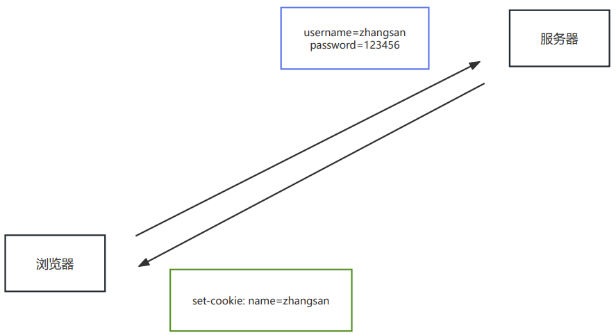
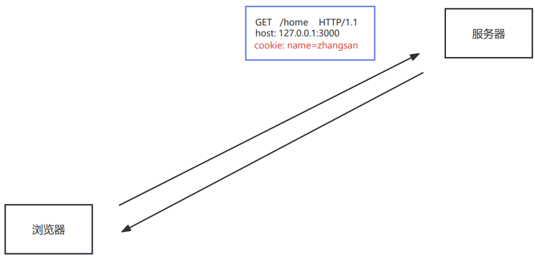
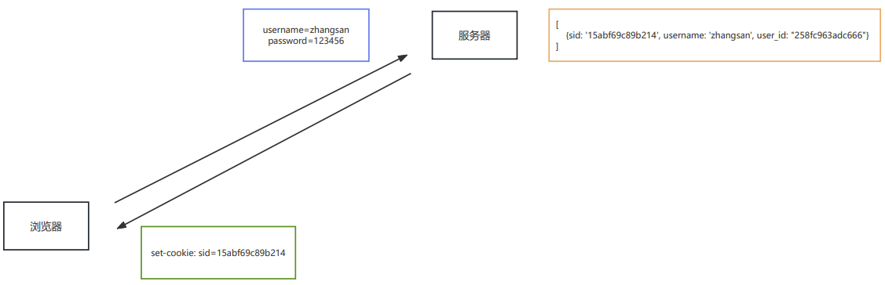
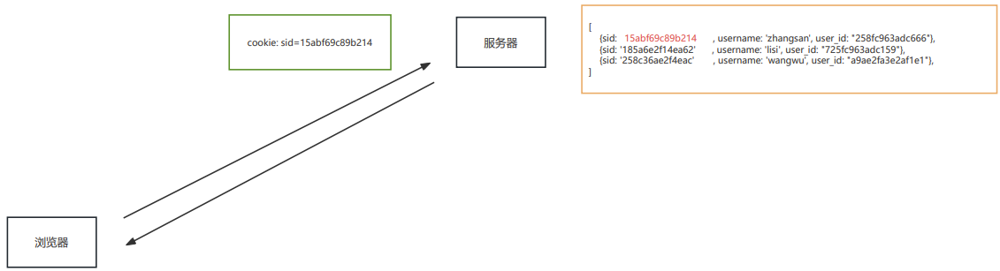
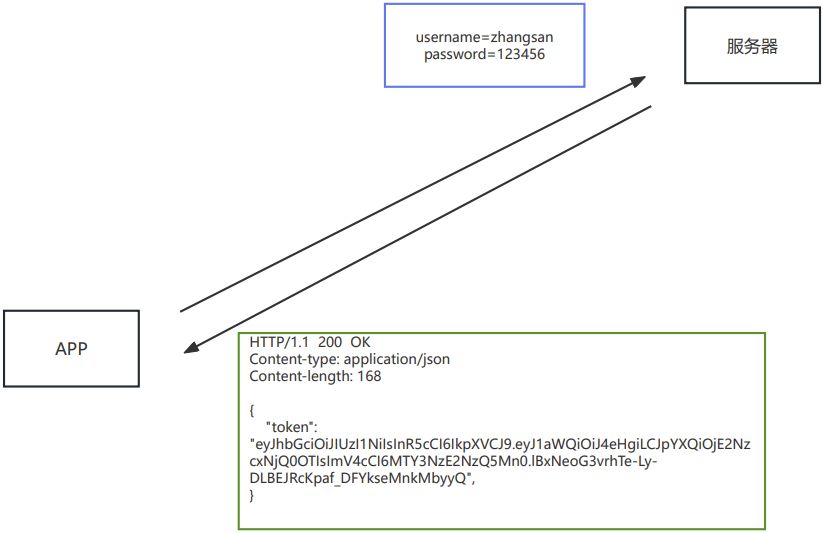
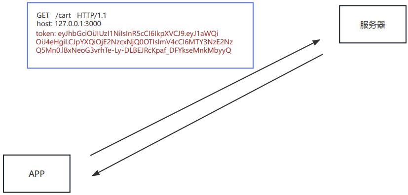
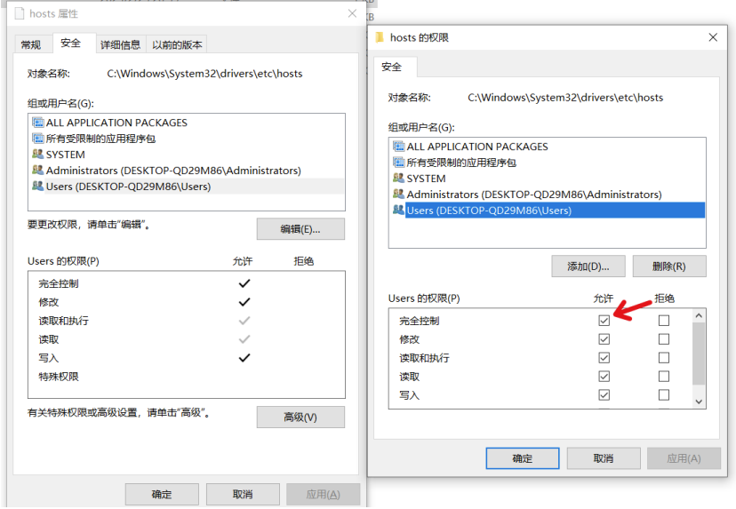

# 会话控制

## 一、介绍
所谓会话控制就是 `对会话进行控制`
HTTP 是一种无状态的协议，它没有办法区分多次的请求是否来自于同一个客户端， `无法区分用户`
而产品中又大量存在的这样的需求，所以我们需要通过 `会话控制` 来解决该问题

常见的会话控制技术有三种：
- cookie
- session
- token


## 二、cookie

### 2.1 cookie 是什么
cookie 是 HTTP 服务器发送到用户浏览器并保存在本地的一小块数据
cookie 是保存在浏览器端的一小块数据
cookie 是按照域名划分保存的

简单示例：
| 域名             | cookie                        |
| ---------------- | ----------------------------- |
| www.baidu.com    | a=100; b=200                  |
| www.bilibili.com | xid=1020abce121; hm=112411213 |
| jd.com           | x=100; ocw=12414cce           |

### 2.2 cookie 的特点
浏览器向服务器发送请求时，会自动将 `当前域名下` 可用的 cookie 设置在请求头中，然后传递给服务器


这个请求头的名字也叫 `cookie` ，所以将 `cookie 理解为一个 HTTP 的请求头也是可以的`

### 2.3 cookie 的运行流程
填写账号和密码校验身份，校验通过后下发 cookie


有了 cookie 之后，后续向服务器发送请求时，就会自动携带 cookie


### 2.4 浏览器操作 cookie
浏览器操作 cookie 的操作，使用相对较少，大家了解即可
1. 禁用所有 cookie
2. 删除 cookie
3. 查看 cookie

### [2.5 cookie 的代码操作](代码/11_会话控制/代码/01_cookie和session/01_cookie.js)
express 中可以使用 `cookie-parser` 进行处理
```js
const express = require('express');
//1. 安装 cookie-parser npm i cookie-parser
//2. 引入 cookieParser 包
const cookieParser = require('cookie-parser');
const app = express();
//3. 设置 cookieParser 中间件
app.use(cookieParser());
//4-1 设置 cookie
app.get('/set-cookie', (request, response) => {
    // 不带时效性
    response.cookie('username', 'wangwu');
    // 带时效性
    response.cookie('email', '23123456@qq.com', { maxAge: 5 * 60 * 1000 });
    //响应
    response.send('Cookie的设置');
});
//4-2 读取 cookie
app.get('/get-cookie', (request, response) => {
    //读取 cookie
    console.log(request.cookies);
    //响应体
    response.send('Cookie的读取');
});
//4-3 删除cookie
app.get('/delete-cookie', (request, response) => {
    //删除
    response.clearCookie('username');
    //响应
    response.send('cookie 的清除');
});
//4. 启动服务
app.listen(3000, () => {
    console.log('服务已经启动....');
});
```

> 不同浏览器中的 cookie 是相互独立的，不共享


## 三、session

### 3.1  session 是什么
session 是保存在 `服务器端的一块儿数据` ，保存当前访问用户的相关信息

### 3.2 session 的作用
实现会话控制，可以识别用户的身份，快速获取当前用户的相关信息

### 3.3  session 运行流程
填写账号和密码校验身份，校验通过后创建 `session` 信息 ，然后将 `session_id` 的值通过响应头返回给浏览器


有了 cookie，下次发送请求时会自动携带 cookie，服务器通过 `cookie` 中的 `session_id` 的值确定用户的身份


### [3.4 session 的代码操作](代码/11_会话控制/代码/01_cookie和session/02_session.js)
express 中可以使用 `express-session` 对 session 进行操作
```js
const express = require('express');
//1. 安装包 npm i express-session connect-mongo
//2. 引入 express-session connect-mongo
const session = require("express-session");
const MongoStore = require('connect-mongo');
const app = express();
//3. 设置 session 的中间件
app.use(session({
    name: 'sid', //设置cookie的name，默认值是：connect.sid
    secret: 'atguigu', //参与加密的字符串（又称签名）
    saveUninitialized: false, //是否为每次请求都设置一个cookie用来存储session的id
    resave: true, //是否在每次请求时重新保存session
    store: MongoStore.create({
        mongoUrl: 'mongodb://127.0.0.1:27017/project' //数据库的连接配置
    }),
    cookie: {
        httpOnly: true, // 开启后前端无法通过 JS 操作
        maxAge: 1000 * 300 // 这一条 是控制 sessionID 的过期时间的！！！
    },
}))
//创建 session
app.get('/login', (req, res) => {
    //设置session
    req.session.username = 'zhangsan';
    req.session.email = 'zhangsan@qq.com'
    res.send('登录成功');
})
//获取 session
app.get('/home', (req, res) => {
    console.log('session的信息');
    console.log(req.session.username);
    if (req.session.username) {
        res.send(`你好 ${req.session.username}`);
    } else {
        res.send('登录 注册');
    }
})
//销毁 session
app.get('/logout', (req, res) => {
    //销毁session
    // res.send('设置session');
    req.session.destroy(() => {
        res.send('成功退出');
    });
});
app.listen(3000, () => {
    console.log('服务已经启动, 端口 ' + 3000 + ' 监听中...');
});
```


## 四、session 和 cookie 的区别
cookie 和 session 的区别主要有如下几点：
1. 存在的位置
   - cookie：浏览器端
   - session：服务端
2. 安全性
   - cookie 是以明文的方式存放在客户端的，安全性相对较低
   - session 存放于服务器中，所以安全性 `相对` 较好
3. 网络传输量
   - cookie 设置内容过多会增大报文体积， 会影响传输效率
   - session 数据存储在服务器，只是通过 cookie 传递 id，所以不影响传输效率
4. 存储限制
   - 浏览器限制单个 cookie 保存的数据不能超过 `4K` ，且单个域名下的存储数量也有限制
   - session 数据存储在服务器中，所以没有这些限制


## 五、token

### 5.1 token 是什么
`token` 是服务端生成并返回给 HTTP 客户端的一串加密字符串， `token` 中保存着 `用户信息`

### 5.2 token 的作用
实现会话控制，可以识别用户的身份，主要用于移动端 APP

### 5.3 token 的工作流程
填写账号和密码校验身份，校验通过后响应 token，token 一般是在响应体中返回给客户端的


后续发送请求时，需要手动将 token 添加在请求报文中，一般是放在请求头中


### 5.4 token 的特点
- 服务端压力更小
  - 数据存储在客户端
- 相对更安全
  - 数据加密
  - 可以避免 CSRF（跨站请求伪造）
- 扩展性更强
  - 服务间可以共享
  - 增加服务节点更简单

### [5.5 JWT](代码/11_会话控制/代码/03_token/jwt.js)
JWT（JSON Web Token ）是目前最流行的跨域认证解决方案，可用于基于 `token` 的身份验证
JWT 使 token 的生成与校验更规范
我们可以使用 `jsonwebtoken 包` 来操作 token
```js
//导入 jsonwebtokan
const jwt = require('jsonwebtoken');
//创建 token
// jwt.sign(数据, 加密字符串, 配置对象)
let token = jwt.sign({
    username: 'zhangsan'
}, 'atguigu', {
    expiresIn: 60 //单位是 秒
});
//解析 token
jwt.verify(token, 'atguigu', (err, data) => {
    if (err) {
        console.log('校验失败~~');
        return
    }
    console.log(data);
});
```

> 扩展阅读：https://www.ruanyifeng.com/blog/2018/07/json_web_token-tutorial.html


## 六、附录

### 6.1 本地域名
所谓本地域名就是 `只能在本机使用的域名` ，一般在开发阶段使用

#### 6.1.1 操作流程
编辑文件 `C:\Windows\System32\drivers\etc\hosts`
```txt
127.0.0.1 www.baidu.com
```

如果修改失败， `可以修改该文件的权限`


#### 6.1.2 原理
在地址栏输入 `域名` 之后，浏览器会先进行 DNS（Domain Name System） 查询，获取该域名对应的 IP 地址
请求会发送到 DNS 服务器，可以 `根据域名返回 IP 地址`
可以通过 `ipconfig /all` 查看本机的 DNS 服务器
`hosts` 文件也可以设置域名与 IP 的映射关系，在发送请求前，可以通过该文件获取域名的 IP 地址

