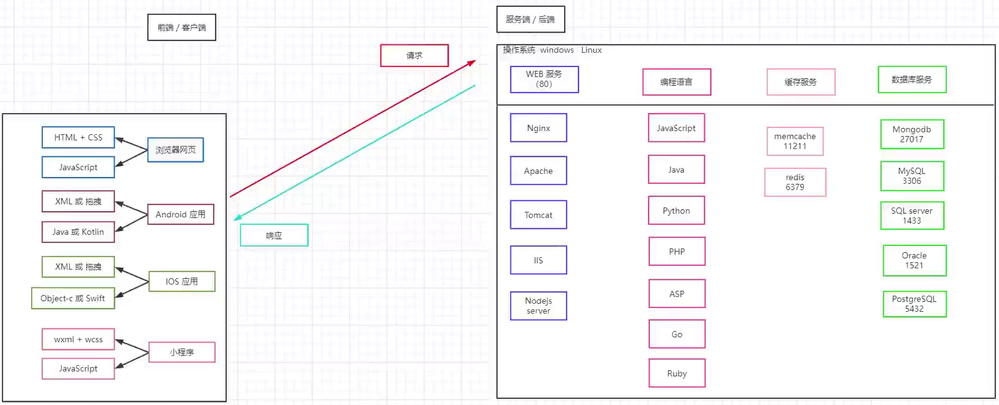
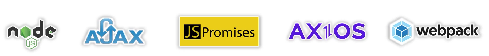
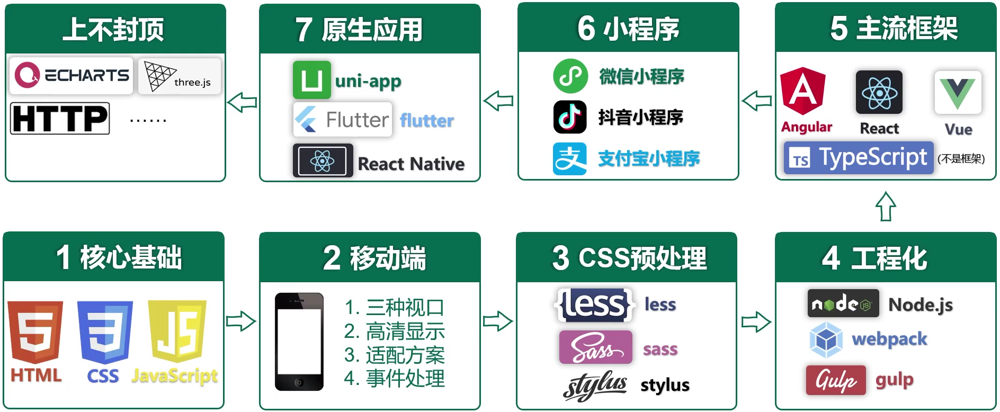

# 尚硅谷2023版Node.js相关
- [00_入门](00_入门.md)
- [01_Buffer](01_Buffer.md) [课件](课件/01_Buffer.pdf)
- [02_fs模块](02_fs模块.md) [课件](课件/02_fs模块.pdf)
- [03_path模块](03_path模块.md) [课件](课件/03_path模块.pdf)
- [04_HTTP协议](04_HTTP协议.md) [课件](课件/04_HTTP协议.pdf)
- [05_NodeJS模块化](05_NodeJS模块化.md) [课件](课件/05_NodeJS模块化.pdf)
- [06_包管理工具](06_包管理工具.md) [课件](课件/06_包管理工具.pdf)
- [07_nvm](07_nvm.md) [课件](课件/07_nvm.pdf)
- [08_express框架](08_express框架.md) [课件](课件/08_express框架.pdf)
- [09_mongodb](09_mongodb.md) [课件](课件/09_mongodb.pdf)
- [10_接口](10_接口.md) [课件](课件/10_接口.pdf)
- [11_会话控制](11_会话控制.md) [课件](课件/11_会话控制.pdf)

## 链接
- [bilibili-尚硅谷2023版Node.js零基础视频教程，nodejs新手到高手](https://www.bilibili.com/video/BV1gM411W7ex)

---

前后端开发

接下来学什么？

